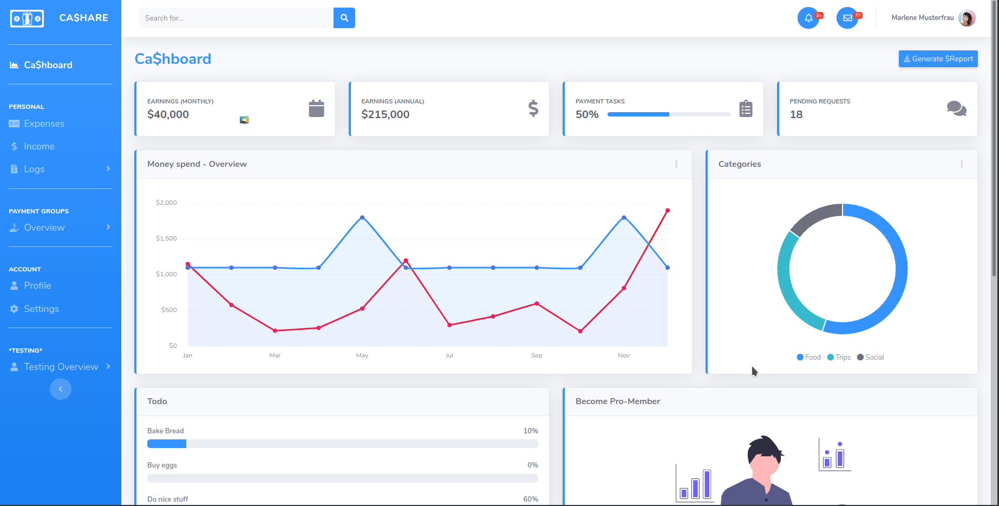

# Gemeinsame-Finanzverwaltung
Projektarbeit 2 der Vorlesung Software-Engineering DHBW Stuttgart
***********************************************************
* Projekt: Webapplikation für gemeinsame Finanzverwaltung *
***********************************************************

Anforderungen ans Projekt:
- Webapplikation
- Datenbankanbindung
- Benutzer und Rechtesteuerung (Rollen)

Vorstellung am 14. Mai 2020

- Pflichtenheft (Spez.)
- Architekturdokument (ARCH42)
- Codierungsrichtlinien
- Konfigmanagement (Versionierung: Minor Major)
- Lauffähige Anwendung
- Planung Betrieb Wartung
- Dokumentation (Benutzeranleitung)

Projektbeschreibung:
Ziel des Projekts ist es Finanzen für bestimmte Dinge Teilen zu können.
Dies kann mit TODO's verbunden werden. Dabei können Kosten aufgeteilt werden oder auch gespartes Geld getrackt werden.

********************************************************************************

## CA$HARE [Template](https://startbootstrap.com/template-overviews/sb-admin-2/)

We used [SB Admin 2](https://startbootstrap.com/template-overviews/sb-admin-2/) which is an open source admin dashboard theme.

## Preview

## Status

## Download and Installation

To begin using this template, choose one of the following options to get started:

-   [Download the latest release on Start Bootstrap](https://startbootstrap.com/template-overviews/sb-admin-2/)
-   Install via npm: `npm i startbootstrap-sb-admin-2`
-   Clone the repo: `git clone https://github.com/BlackrockDigital/startbootstrap-sb-admin-2.git`
-   [Fork, Clone, or Download on GitHub](https://github.com/BlackrockDigital/startbootstrap-sb-admin-2)

## Usage

After installation, run `npm install` and then run `npm start` which will open up a preview of the template in your default browser, watch for changes to core template files, and live reload the browser when changes are saved. You can view the `gulpfile.js` to see which tasks are included with the dev environment.

### Gulp Tasks

-   `gulp` the default task that builds everything
-   `gulp watch` browserSync opens the project in your default browser and live reloads when changes are made
-   `gulp css` compiles SCSS files into CSS and minifies the compiled CSS
-   `gulp js` minifies the themes JS file
-   `gulp vendor` copies dependencies from node_modules to the vendor directory

You must have npm installed globally in order to use this build environment. This theme was built using node v11.6.0 and the Gulp CLI v2.0.1. If Gulp is not running properly after running `npm install`, you may need to update node and/or the Gulp CLI locally.

## About

Start Bootstrap is an open source library of free Bootstrap templates and themes. All of the free templates and themes on Start Bootstrap are released under the MIT license, which means you can use them for any purpose, even for commercial projects.

-   <https://startbootstrap.com>
-   <https://twitter.com/SBootstrap>

## Copyright and License

[MIT](https://github.com/BlackrockDigital/startbootstrap-resume/blob/gh-pages/LICENSE) license.
